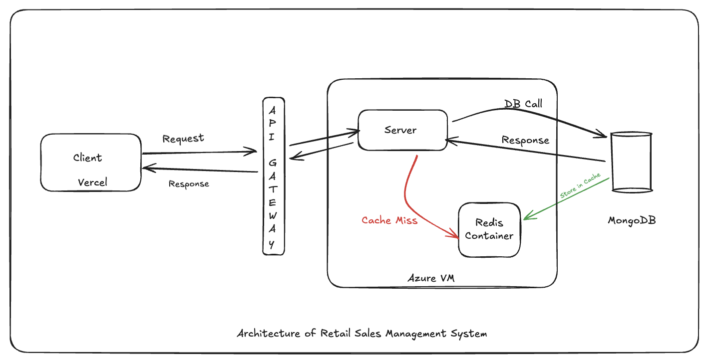
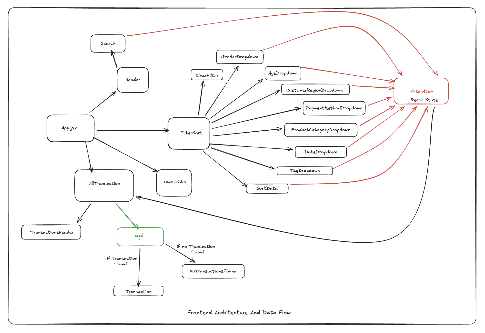
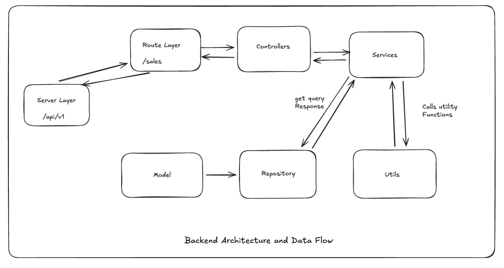

## Architecture of Retail Sales Management System

### 1. Application Architecture

<p align="center">
  
</p>


<p align="center">
  
</p>

##
### 2 Frontend Architecture and Data Flow
<p align="center">
  
</p>

##

### 3 Backend Architecture and Data Flow

<p align="center">
  
</p>

##

### 4. Folder Structure

```
.
├── backend/                                # Backend (Node.js + Express)
│   ├── src/
│   │   ├── controllers/                    # Route handlers
│   │   ├── models/                         # Mongoose schemas / DB models
│   │   ├── repository/                     # Database queries & repository layer
│   │   ├── routes/                         # API routes
│   │   ├── services/                       # Business logic
│   │   ├── utils/                          # Helper utilities
│   │   └── index.js                        # Entry point of backend server
│   │
│   ├── package.json                        # Backend dependencies & scripts
│   └── package-lock.json
│
├── frontend/                               # Frontend (React + Vite)
│   ├── public/                             # Static files served directly
│   │
│   ├── src/                                # Application source code
│   │   ├── api/                            # API service functions (Axios calls)
│   │   ├── assets/                         # Images, icons, fonts
│   │   ├── atoms/                          # Recoil global state
│   │   ├── components/                     # Reusable UI components
│   │   ├── styles/                         # Global CSS/styles
│   │   ├── utils/                          # Helper utilities
│   │   ├── App.jsx                         # Root React component
│   │   └── main.jsx                        # Entry point (ReactDOM)
│   │
│   ├── index.html                          # Vite HTML template
│   ├── package.json                        # Frontend dependencies
│   └── package-lock.json
│
├── docs/
│   └── architecher.md                      # Architecture documentation
│
└── README.md                               # Main project documentation


```

##

### 5 API Structure

```javascript
// Example : 
GET /api/v1/sales?
search=neha&
region=East,West&
gender=Female&
category=Beauty,Electronics&
tags=organic,skincare&
payment=UPI&
ageMin=20&ageMax=40&
dateStart=2023-01-01&
dateEnd=2023-12-31&
sort=date&
page=1

Response
{
  page: number;
  totalPages: number;
  total: number;

  sales: SaleItem[];

  summary: {
    totalQuantity: number;
    totalAmount: number;
    finalAmount: number;
  };
};


```


